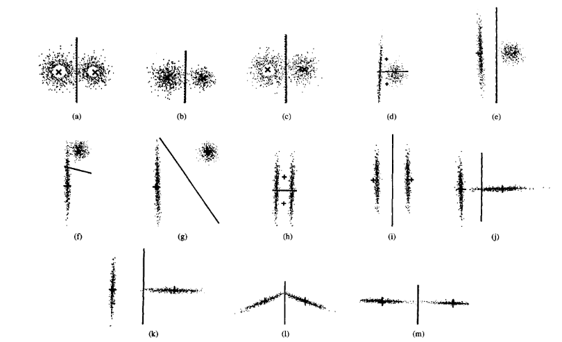

## Note About multi-class Clustering by two-class Formulas ##
<!---
  need to abstrate how this alg. work 
  and its main spirit
-->

#### Dense cuts v.s. Sparse cuts ####

how to judge whether a Cut C is dense or not

#### Parse 1: Split ####
<!---
  1. how to determining whether keep on spliting or not
  2. 
-->

> Step 1. Read in the input data set ***H***. Construct a binary tree ***T***, the root node witch represents 
> the set ***H***.

> Step 2. For each non-grounded leaf ***U***, apply the analytical two-class clustering tool to produce
> a cut C that split ***U*** into two subset ***UA*** and ***UB***.

> Step 3. For every node ***W***, when too many ******C*******desen* happened then withdraw those dense cuts
> and discard all nodes descending from the node ***W*** and mark a grounded sign on the node ***W***.

> Step 4. If there are too many leaves (eg. more than 64 leaves), then stop.
> *(but this condition is rarely happen)*

> Step 5. If some leaves of tree are still not grounded, go to Stop 2.

#### Parse 2: Merge ####

#### Some Experiment Results ####

#### Reference ####

> Feature-Preserving Clustering of 2-D Data for Two-Class Problems Using Analytical Formulas: An Automatic and Fast Approach
  
> *IEEE TRANSACTIONS ON PATTERN ANALYSIS AND MACHINE INTELLIGENCE, VOL. 16, NO. 5, MAY 1994, jclin*
[Link to paper](https://www.google.com.tw/url?sa=t&rct=j&q=&esrc=s&source=web&cd=1&cad=rja&uact=8&ved=0CCIQFjAAahUKEwiOoN2O-ZTIAhWHHZQKHT0JD18&url=http%3A%2F%2Fwww.asia.edu.tw%2FMain_pages%2Fabout%2FFormer_president_TsaiWH_publications%2FJournal%2520Paper%2520PDFs%2FLin_%2526_Tsai_IEEETPAMI_1994.pdf&usg=AFQjCNGRFZ_eAulJSEWQmgLzNBGS4WEUHQ&sig2=jqF-oGfHxDMyBxhXVEP5oA) 
