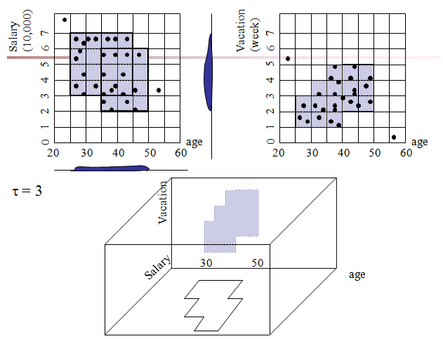

## Challenge ##

An emerging trend is that new applications tend to generate data 
in very **high dimensions** for which traditional methodologies of cluster analysis 
do not work well. Remedies include dimension reduction(PCA, SOMs) and feature 
transformation, but it is a challenge to develop effective instantiations of 
these remedies in the high-dimensional clustering setting.  

* **curse of dimensionality**: when the dimensionality increases, the volume of 
the space increases so fast that the available data become **sparse**. This sparsity 
is problematic for any method that requires statistical significance.
> Conceptually our data is “lost in space” as we go to higher dimensions.
> Multiple dimensions are hard to think in, impossible to visualize, and, due to 
the exponential growth of the number of possible values with each dimension, 
complete enumeration of all subspaces becomes intractable with increasing 
dimensionality. 

* not only hard to compute but hard to find relationship:  
> traditional similarity measures as used in conventional clustering algorithms 
are usually not meaningful
> For example, as the number of dimensions tend to infinity the distance between 
any two points in the dataset converges. This means the maximum distance and minimum 
distance between any two points of your dataset will be the same.

> The concept of distance becomes less precise as the number of dimensions grows, 
since the distance between any two points in a given dataset converges. The 
discrimination of the nearest and farthest point in particular becomes meaningless.

* **local feature relevance problem**: different clusters might be found in 
different subspaces, so a global filtering of attributes is not sufficient. 
> A cluster is intended to group objects that are related, based on observations 
of their attribute's values. However, given a large number of attributes some of 
the attributes will usually not be meaningful for a given cluster. 

**Probles in feature seletion and dimension reduction**  
Feature selection or dimensionality reduction techniques are global in the 
following sense:  
> They generally compute only one subspace of the original data space in which 
the clustering can then be performed.

## Notes ##

* top-down and bottom-up approaches
  * top-down: anticipate cluster members and then determines the subspace of each cluster
  * bottom-up: anticipate the subspaces of the clusters and then determines the cluster members
    * 先從所有 1-dim space 開始找, 再嘗試所有排列組合,計算最有可能的 space

**Overview clustering methods in high-dim**  

* Projected Clustering Algorithms: aim at finding a unique assignment of points 
to subspace clusters.
  * PreDeCon (2004)
  * CLTree (2000)

**Notes about famous clustering methods**  

* `DBSCAN` (1996): 藉由預先給定的 r(半徑) 和 MinPts(密度) 將每個 datapoint 標記為 `核心點` `邊緣點` `雜訊` 
刪除雜訊後再將所有在彼此半徑內的`核心點`化為一群, 再將`邊緣點`分配給各群
  * `核心點`: 半徑內密度夠高的點
  * `邊緣點`: 在`核心點`半徑內的點
  * `雜訊`: 兩者皆非的點
  * pros: 不用預先給 K
  * cons: 不適用 high-dim
    
* `CLTree` (2000): 將原生 dataset 想像成 class X, 然後再加入 N 個 uniform distribution 
假想點作為 class Y. 如此一來就把問題轉換為 classification problem. 再藉由 Decision tree 將
兩者區分開來。  
The reason that this technique works is that if there are clusters in the data, 
the data points cannot be uniformly distributed in the entire space.
  * pros:
    * without making any prior assumptions or using any input parameters
    * find clusters in the full dimension space as well as in any subspaces
    * find the empty (sparse) regions
    * It deals with outliers effectively
  * cons:
    * N 的個數對結果影響很大
    * 如果 block 之間沒有直接相連(touch)的話，不會被 merge

* `CLIQUE` (1998): 先將所有的維度都劃分成等量的區間(grid basede unit)，然後依據 
user input i(是否為 dense 的 threshold) 將 >= i 的 `unit` 標記為 `dense`，同時相鄰
的 `dense` merge 成 `cluster`，如果 k-1 dim 延伸在 k dim 上的交集也大於 threshold 
(i) 的話，那麼 k space 亦是 candidate subspace。  
> notice: 如果 k space 不滿足 candidate space 的條件，那麼 k+1 亦不為之。

  

* `SUBCLU` (2004): base on `CULQUE` 但是用 `DBSCAN` 決定哪些 `dense` 需要被 merge 
成 `cluster`

## Research Direction ##
- [ ] if we use some dimension reduction technique to get low-dim data, can we find 
what attributes constitute(or each attribute's rate) in the new coordinate.

- [ ] design a system to conquer high-dim data

- [ ] 現在的方法(model)大多都只考慮點與點兩兩之間的關係(pair)，但以證明考慮越多點越
能描述模型。  
e.g. t-sne 中使用 t-student/gaussian kernel, 但他在計算相似度的時候只考慮 Xi, Xj 之間
的關係而非考慮多個點。  
  

目前有人開始引入 Jensen-Shannon Divergence 計算相似度(原通訊領域技術)
-> base idea: 亦即由 data 本身決定變量  

[Jensen-Shannon-link1](http://thelightroad.blogspot.tw/2012/04/jensen-shannon-divergence.html)

-----

## Related Work ##

### PCA ###

PCA is _not_ a clustering method and also _not_ necessarily a method primrily.
Many research use it to reduce dimensionality but it might not be bset as it 
is a **linear** and **parametric**, **nonlinear** and **nonparametric** method 
should not be ignored.

> **Drawbacks**:  
> Only preserves large pairwise distances between the points.
> Meaning points which are *far apart in **high-dimensional space** would also appear 
> far apart in **low-dimensional subspace***.

Consider the following dataset:

---

PC1 axis is maximizing the variance of the projection. So in this case it will 
obviously go diagonally from lower-left to upper-right corner:

### [t-SNE](http://lvdmaaten.github.io/tsne/)  ###

t-SNE is _not_ a clustering technique. It can be used to embed high-dimensional 
data into low dimensions.

## References ##

#### [useful] ####

#### [record] ####

[1] [Random Projection for High Dimensional Data Clustering](https://www.aaai.org/Papers/ICML/2003/ICML03-027.pdf)

[2] [A Single-Pass Algorithm for Efficiently Recovering Sparse Cluster Centers of High-dimensional Data](http://jmlr.org/proceedings/papers/v32/yib14.pdf)

[3] [Visualizing Data using t-SNE](http://lvdmaaten.github.io/publications/papers/JMLR_2008.pdf)
> **Abstract**  
> t-SNE is *not* a clustering technique. It can be used to embed high-dimensional 
> data into low dimensions, e.g., 2D for human-intuitive visualization.

[4] [Accelerating t-SNE using Tree-Based Algorithms](http://lvdmaaten.github.io/publications/papers/JMLR_2014.pdf)
([video](https://www.youtube.com/watch?v=RJVL80Gg3lA&list=UUtXKDgv1AVoG88PLl8nGXmw))

[5] [Clustering of the Self-Organizing Map (SOM)](http://ieeexplore.ieee.org/stamp/stamp.jsp?arnumber=846731)

[6] [Cluster Forests](http://research.google.com/pubs/pub41339.html)
([pdf](http://static.googleusercontent.com/media/research.google.com/zh-TW//pubs/archive/41339.pdf))

> **Abstract**   
> inspiration from Random Forests (classification), CF randomly probes a 
high-dimensional data cloud to obtain “good local clusterings” and then aggregates 
via spectral clustering to obtain cluster assignments for the whole dataset.  
> The main approaches to aggregation of clustering instances are the *coassociation method*
> and the *hyper-graph method*.
>   CF is based on co-association, specifically using spectral clustering for aggregation.
>   *Computational Statistics and Data Analysis, vol. 66 (2013), pp. 178-192*  

> **Author's webside**  
> [Donghui Yan](https://sites.google.com/site/dhyan2004/home)

[7] Clustering High-Dimensional Data: A Survey on Subspace Clustering, 
Pattern-Based Clustering, and Correlation Clustering
([pdf](http://delivery.acm.org/10.1145/1500000/1497578/a1-kriegel.pdf?ip=140.113.27.55&id=1497578&acc=ACTIVE%20SERVICE&key=AF37130DAFA4998B%2E7DDA227B4DBFAC43%2E4D4702B0C3E38B35%2E4D4702B0C3E38B35&CFID=737371875&CFTOKEN=48620632&__acm__=1449917191_816408c802b8f65943020c584dc2c22a))

[8] Subspace Clustering for High Dimensional Data: A Review 
([pdf](http://delivery.acm.org/10.1145/1010000/1007731/p90-parsons.pdf?ip=140.113.27.55&id=1007731&acc=ACTIVE%20SERVICE&key=AF37130DAFA4998B%2E7DDA227B4DBFAC43%2E4D4702B0C3E38B35%2E4D4702B0C3E38B35&CFID=737371875&CFTOKEN=48620632&__acm__=1449919072_deb63b9196b941c5956499204b3b4435))

#### [info from webside] ####

* http://stats.stackexchange.com/questions/176672/what-is-meant-by-pca-preserving-only-large-pairwise-distances
* [scikit-learn](http://scikit-learn.org/stable/modules/clustering.html#clustering)
* [Neural Information Processing Systems](https://nips.cca)

<!-- [problem]
how to decide # of sub tree?
how to aggregates votes?
if sub tree is binary decision, how to decide? threshold at each feature?

[?] letting τ denote the number of consecutive unsuccessful attempts in expanding 
the clustering vector f˜.

-->

<!-- [keyword]
feature selection
random forest
cluster quality measure kappa
-->

<!--
RF is a supervised learning methodology and as such there is a clear goal
to achieve.

treating clustering as an optimization problem under an explicitly defined cost
criterion.

Algorithm 1 is called `feature competition`
It aims to provide a good initialization for the growth of a clustering vector.

-->

