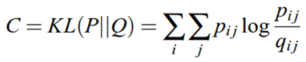

## t-distributed Stochastic Neighbor Embedding (t-SNE) ##

### Abstract ###
**main idea**  
找到與高維度上分佈差異最小的低維度分布
> t-Distributed stochastic neighbor embedding (t-SNE) minimizes the divergence 
between two distributions

> If the map points yi and yj correctly model the similarity between the high-dimensional 
datapoints xi and xj, the conditional probabilities pj|i and qj|i will be equal.
> SNE aims to find a low-dimensional data representation that minimizes the mismatch between
pj|i and qj|i.

* 高維度上以高斯分布建機率模型; 低維度上則以 t-distributions。
* t-distributions 適合樣本數較少的情況(<30)，而 t-SNE 以 local structure 建機率
模型，故樣本數會變小。
  * ?: 高維也用 local structure 減少計算量，樣本數不也會變小?
  * ?: 為什麼要加入機率模型計算相似度?
> The affinities in the original space are represented by **Gaussian joint 
probabilities** and the affinities in the embedded space are represented by 
**Student’s t-distributions**.

?????
> t-SNE will focus on the local structure of the data and will tend to extract 
clustered local groups of samples as highlighted on the S-curve example.

以 KL 計算兩分布的相似度，並以梯度方向找出 local minimal
> The Kullback-Leibler (KL) divergence of the joint probabilities in the original 
space and the embedded space will be minimized by gradient descent.

-----

### Algorithm ###

* 目標是要在低維度(2D or 3D)中建立一個盡可能保留高維度中兩兩點之間關連性的 map。
首先先定義高維度空間 local structure 中點兩點間的相似性
  * 高維中以高斯分布建立機率模型
  * 其中 σ(i) 為高斯分布的 bandwidth，由預先設定好的 perplexity(設定 local 
structure 的 objects 數) 間接決定
  * 為了讓每個 Xi 都能有一定程度的貢獻，以及對稱性，實際運算多考慮條件機率  
  
  

* 以亂數或是 PCA 預先降維至目標維度(e.g. 2D)
  * 以 PCA 產生較佳，因為 PCA 有保留 global structure 的特性.(找出 data 分布的主軸; 
最小差異度)
  * 僅以亂數產生 init solution 的話容易發生 local optimal 的問題
  * 可以藉尤其他參數擾動，有機會改善 local optimal 的問題

* 可由高維度的 local structure 得知對應低維度的 local structure，並以 t-distributions 
建立機率分布模型
  * 選擇使用 t-distributions 是因為其 heavy tail 的特性(這部分沒有很懂)
  * t-distributions 運算量較小  

* 接著以 KL 計算高低維度分布之間的相似度，KL 值越大則相似度越低，反之亦然。
  * 需要注意的是 KL 是不對稱的，可能會出現預期外的結果，
    * pij 大; qij 小 -> KL 大 (O)
    * pij 小; qij 大 -> KL 小 (X)
  * 但是 pij 較小時對整體結果影響不大，故可忽略  

* 為了找出最小 KL 值，藉由 gradient 逼近 local minimal
  * 這裡可以用 Barnes-Hut 做加速  

-----

**The disadvantages to using t-SNE are roughly:**  
* t-SNE is computationally expensive, and can take several hours on million-sample 
datasets where PCA will finish in seconds or minutes.
* The Barnes-Hut t-SNE method is limited to two or three dimensional embeddings.
* The algorithm is stochastic and multiple restarts with different seeds can yield 
different embeddings. However, it is perfectly legitimate to pick the the embedding 
with the least error.
* Global structure is not explicitly preserved. This is problem is mitigated by 
initializing points with PCA (using init=’pca’).

### Refences ###
* How to choose the right estimator? ([link])

### Proper noun ###
**convex v.s. non-convex**  
* convex optimization there can be **only one** optimal solution, which is **globally optimal**.
* nonconvex optimization may have **multiple locally optimal** points and it can take 
a lot of time to identify whether the problem has no solution or if the solution is global.

**Crowding Problem**  

-----

**highlight sentance**

* t-SNE determines the local neighborhood size for each datapoint separately based on the
local density of the data (by forcing each conditional probability distribution Pi
to have the same perplexity).

-----
[link]: http://scikit-learn.org/stable/tutorial/machine_learning_map/
